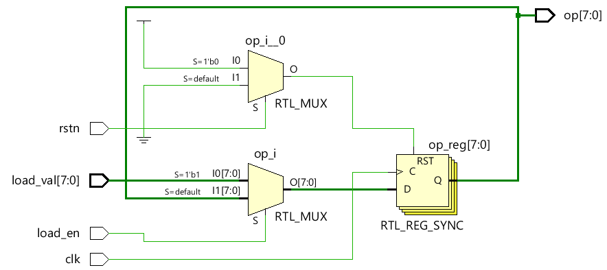

# 概述
本文是[Verilog Tutorial](https://www.chipverify.com/verilog/verilog-tutorial)的学习笔记。

# Verilog数据类型
[例子 types](./code/type/types.v)
## Nets类型
* Nets类型不存储数据，只负责连接
* 常见的Nets类型是`wire`
* 如下图所示，`net_11`连接了AND门电路的输出和触发器的某个输入引脚


## Variables类型
* Variables类型用于存储数据，如触发器可用于存储数据
* 常见的Variables类型是`reg`
* 如下图所示，左侧的触发器可存储1-bit数据，而右侧的触发器可存储4-bits数据


## 其他基本数据类型
* integer
    - 32-bits
    - 整形
* time
    - 64-bits
    - unsigned
    - 用于存储仿真时间，以便调试
    - 整型，表示时间单位的个数
* realtime
    - 浮点型
* real
    - 存储浮点型小数

## 组合数据类型
* 字符串类型
    - Verilog的字符串有`reg`类型构成
    - `reg [8*11:1] str = "Hello World"; // Variable can store 11 bytes, str = "Hello World"`

* Vector
    - 多个net类型或reg类型的组合
    - `wire [3:0] n0;`
    - `reg [3:0] d0;`
    - [例子](./code/vector/register.v)
    

* Array
    - Array和Vector不同，Vector综合后是一个电路单元，Array综合后是多个电路单元
    - Array可以是多个`reg`,`wire`,`integer`,`real`数据类型
    - `reg        y1 [11:0];        // y is an scalar reg array of depth=12, each 1-bit wide`
    - `wire [0:7] y2 [3:0]          // y is an 8-bit vector net with a depth of 4`
    - `reg  [7:0] y3 [0:1][0:3];    // y is a 2D array rows=2,cols=4 each 8-bit wide`
    - [例子](./code/array/registers.v)
    

# Building Blocks

## Verilog模块
* [例子：D触发器模块](./code/dff/dff.v)


* 什么是`top-level module`?
    * top-level模块包含其他所有模块
    * 分为：`Design Top Level Module`和`Testbench Top Level`

## Verilog端口
* 端口类型
    - input
    - output
    - inout
* 所有端口默认声明类型为`wire`
* 输出端口如果需要存储数据，可以声明为`reg`
* 输入端口只能声明为`wire`，因为他们需要被外部立即驱动，而不是接一个触发器再驱动
```verilog
// Case #1 : Inputs are by default implicitly declared as type "wire"
module des0_1  (input wire clk ...);     // wire need not be specified here
module des0_2   (input clk, ...);       // By default clk is of type wire

// Case #2 : Inputs cannot be of type reg
module des1 (input reg clk, ...);     // Illegal: inputs cannot be of type reg

// Case #3: Take two modules here with varying port widths
module des2 (output [3:0] data, ...);  // A module declaration with 4-bit vector as output
module des3 (input [7:0] data, ...);   // A module declaration with 8-bit vector as input

module top ( ... );
wire [7:0] net;
des2  u0 ( .data(net) ... );     // Upper 4-bits of net are undriven
des3  u1 ( .data(net) ... );     
endmodule

// Case #4 : Outputs cannot be connected to reg in parent module
module top_0 ( ... );
reg [3:0] data_reg;

des2 ( .data(data) ...);   // Illegal: data output port is connected to a reg type signal "data_reg"
endmodule
```

## Verilog assign赋值语句
* 赋值声明语句<br>
`assign <net_expression> = [drive_strength] [delay] <expression of different signals or constant value>`
* 赋值规则
    - 左侧接收变量不能是`reg`类型，因为`reg`类型不需要持续赋值，对`reg`类型的赋值需要在`initial`或`always`过程块中进行
    - 只要右侧值发生改变，左侧变量就会被更新一次，因此`assign`也被称为持续赋值

## always过程块
* 语法
```verilog
always @ (event)
  [statement]
 
always @ (event) begin
  [multiple statements]
end
```

* 如果`always`没有定义`sensitivity list`会如何？
    - 如果没有指定`always`的触发条件，仿真程序会持续执行`always`模块
    - `always clk = ~clk;`，这条语句会让仿真程序hang死
    - `always #10 clk = ~clk;`，这条语句会产生周期为20的方波
    - `always`块即可以设计时序电路，也可以设计逻辑电路。两者的区别就是`sensitivity list`不同，如果是逻辑电路，`sensitivity list`监控所有关心变量的变化
    - 因为过程块中被赋值的变量需要是`reg`类型，所以用`always`设计逻辑电路时，输出端口类型不能是`wire`类型

## initial过程块
* 语法
```verilog
initial 
    [single statement]
 
initial begin
[multiple statements]
end
```

* initial过程块的作用是什么？
    - initial过程块不会被综合，因此也不会被转换成硬件电路
    - initial过程块主要用来初始化变量

## 过程块与类型
* Verilog中的三个基本过程块
    - `always @(condition)`
    - `initial`
    - `assign [LHS] = [RHS]`

* 常见规则
    - `reg`只能在`initial`或`always`中被赋值
    - `wire`只能通过`assign`赋值
    - 如果`initial/always`包含多条语句，需要用`begin...end`包裹

## generate过程块(生成块)
* 什么是生成块？
    - 生成块可以动态生成Verilog代码
    - 生成块可以通过参数，对实例引用进行控制
* 循环生成
    - [例子: half-adder](./code/gen-for/half_adder.v)
    - 利用生成块实现了参数化`N`代码，下图是`N=2`的testbench:
    
* 条件生成和case生成
    - 和循环生成一样，控制Verilog代码实现条件
    - [例子：mux](./code/gen-if/mux.v)

## 模式探测器例子
* [Verilog Pattern Detector](./code/detector/det.v)
* 输出结果：
```
T=10 in=0 out=0
T=30 in=0 out=0
T=50 in=0 out=0
T=70 in=0 out=0
T=90 in=0 out=0
T=110 in=1 out=0
T=130 in=1 out=0
T=150 in=0 out=0
T=170 in=1 out=0
T=190 in=0 out=0
T=210 in=1 out=0
T=230 in=1 out=1
T=250 in=1 out=0
T=270 in=0 out=0
T=290 in=1 out=0
T=310 in=0 out=0
T=330 in=1 out=0
T=350 in=1 out=1
T=370 in=1 out=0
T=390 in=1 out=0
T=410 in=1 out=0
Simulation complete via $finish(1) at time 430 NS + 0
```

# 行为级模型
## 块
* 两种块
    - 顺序块`begin...end`
    - 并行块`fork...join`
* [例子: 块](./code/block/blocktb.v)

## 赋值
* 赋值形式
    - 直接赋值(Procedural Assignment)
        - 发生在`always`,`initial`,`task`和`functions`中
        - 被赋值的变量一直保持不变，除非被再次赋值
        - 所有变量都适用此方式的赋值，包括array类型
        - 声明时初始化的非法形式(array): `reg [3:0] array [3:0] = 0; //illegal`
    - 连续赋值(Continuous Assignment)
        - 发生在连续赋值语句`assign`中，独立于过程块
        - 赋值的变量为net类型
    - Procedural Continuous Assignment
        - 发生在过程块语句中
        - 可修饰nets和variables
        - 
        - 形式:
        ```verilog
        reg q;
        initial begin
        assign q = 0;
        #10 deassign q;
        end

        reg o, a, b;
        initial begin
        force o = a & b;
        ...
        release o;
        end
        ```

## 阻塞与非阻塞赋值
### 阻塞赋值`=`
* 在顺序块的一个仿真时间点，前面的赋值语句一定先完成

### 非阻塞赋值`<=`
* 赋值动作发生在当前仿真时间(simulation time)的结尾
* [例子 non-blocking](./code/assignment/non_block.v)

## for Loop
* [例子 for-loop](./code/for/lshift.v)
* 如下图所示，`for`循环可以使代码更加整洁


## function
* 语法
```
function [automatic] [return_type] name ([port_list]);
  [statements]
endfunction
```
* `automatic`用于使function变成可重入，不然所有调用者共享此函数
* function中不能使用和时间相关的语句，如:`#,@,wait,posedge,negedge`
* function中不能用非阻塞赋值，`force-release`或者`assign-deassign`

## task
* 语法
```
// Style 1
task [name];
input  [port_list];
inout  [port_list];
output [port_list];
begin
    [statements]
end
endtask

// Style 2
task [name] (input [port_list], inout [port_list], output [port_list]);
begin
    [statements]
end
endtask
```
* `automatic`用于使task变成可重入，不然所有调用者共享此任务

## Verilog Parameters
* Parameters分类
    - Module parameter
    - Specify parameter
### Module parameter
* 定义
```verilog
module design_ip 
  #(parameter BUS_WIDTH=32, 
    parameter DATA_WIDTH=64) (  
 
    input [BUS_WIDTH-1:0] addr,
     // Other port declarations
   );
```
* 调用者override
```verilog
module tb;
    // Module instantiation override
    design_ip  #(BUS_WIDTH = 64, DATA_WIDTH = 128) d0 ( [port list]);
    // Use of defparam to override
    defparam d0.FIFO_DEPTH = 128;
 
endmodule
```

### Specify parameter
```verilog
// Use of specify block
specify
specparam  t_rise = 200, t_fall = 150;
specparam  clk_to_q = 70, d_to_q = 100;
endspecify

// Within main module
module  my_block ( ... );
    specparam  hold = 2.0;
    specparam  ddy  = 1.5;

    parameter  WIDTH = 32;
endmodule
```

# 门级模型
## 延时
* Rise, Fall and Turn-Off 延时
```verilog
// Single delay specified - used for all three types of transition delays
or #(<delay>) o1 (out, a, b);
 
// Two delays specified - used for Rise(0 to 1) and Fall(1 to 0) transitions
or #(<rise>, <fall>) o1 (out, a, b);
 
// Three delays specified - used for Rise, Fall and Turn-off(to z) transitions
or #(<rise>, <fall>, <turn_off>) o1 (out, a, b);
```
* [例子：delay](./code/delay/des.v)仿真结果分析
```verilog
// 仿真结果
T=0 a=0 b=0 and=x bufif0=x // ab初始化监控
T=3 a=0 b=0 and=0 bufif0=x // and-fall在3时间单位(fall-delay:3)发生
T=6 a=0 b=0 and=0 bufif0=0 // bufif0-fall在6时间单位(fall-delay:6)发生
T=10 a=1 b=0 and=0 bufif0=0 // tb在10单位时间，赋值a为1
T=15 a=1 b=0 and=0 bufif0=1 // bufif0-rise在15时间单位(rise-delay:5, 10+5)发生
T=20 a=1 b=1 and=0 bufif0=1 // tb在20单位时间，赋值b为1
T=22 a=1 b=1 and=1 bufif0=1 // and-rise在22单位时间(rise-delay:2, 20+2)发生
T=27 a=1 b=1 and=1 bufif0=z // bufif0-turn_off在27单位时间(turn_off-delay:7, 20+7)发生
T=30 a=0 b=1 and=1 bufif0=z // tb在30单位时间，赋值a为0
T=33 a=0 b=1 and=0 bufif0=z // and-fall在33时间单位(fall-delay:3, 30+3)发生
T=40 a=0 b=0 and=0 bufif0=z // tb在40单位时间，赋值b为0
T=46 a=0 b=0 and=0 bufif0=0 // bufif0-fall在46单位时间(fall-delay:6, 40+6)发生
```

# Verilog仿真
## 仿真波形
* update event<br>
每个变量每一次改变都被称作`update event`
* evaluation event<br>
某些语句对`update event`敏感，当有`update event`发生，会触发这些语句执行，我们称作此动作为`evaluation event`
* event queue
因为在同一时刻有可能发生多个`evaluation event`，它们的执行顺序被`event queue`记录
* simulation time
Verilog会按照仿真时间执行，但是如果多个动作同时在一个仿真时间发生，就需要遵循下面的规则
## Regions in event queue

|  Events   | Description  |
|  ----  |  ----  |
|  Active  | Occur at the current simulation time, and can be processed in any order  |
|  Inactive  | Occur at the current simulation time, but is processed after all active events are done  |
|  Nonblocking  | Evaluated at some previous time, but assignment is done in the current simulation time after active and inactive events are done  |
|  Monitor  |  Processed after all the active, inactive and non-blocking events are done  |
|  Future  |  Occur at some future simulation time  |

* 可参考[Nonblocking的例子](./code/assignment/non_block.v)，加深理解。

## Verilog Timescale
* 语法
```verilog
`timescale <time_unit>/<time_precision>
 
// Example
`timescale 1ns/1ps
`timescale 10us/100ns
`timescale 10ns/1ns
```
* [例子1: 1ns/1ns](./code/timescale/tb1.v)
* [例子2: 10ns/1ns](./code/timescale/tb2.v)
* [例子3: 1ns/1ps](./code/timescale/tb3.v)


## Verilog Scheduling Semantics
### Event Queue
* 一个仿真点分为四个区域
    * active events
    * inactive events
    * nonblocking assign events
    * monitor events
### 是什么让仿真存在不确定性？
* 竞争
* active events会以任意顺序从event queue中被移除

## Verilog Display Tasks
### Display/Write Tasks
* `write`不会自动添加换行
### Strobes
* `strobe`打印当前仿真时间最后时刻的变量值，参考[例子](./code/display/strobe.v)
### Continuous Monitors
* `monitor`会持续打印变量的改变
### 常见打印格式
|  Argument   | Description  |
|  ----  |  ----  |
|  %h, %H  |  Display in hexadecimal format  |
|  %d, %D  |  Display in decimal format  |
|  %b, %B  |  Display in binary format  |
|  %m, %M  |  Display hierarchical name  |
|  %s, %S  |  Display as a string  |
|  %t, %T  |  Display in time format  |
|  %f, %F  |  Display 'real' in a decimal format  |
|  %e, %E  |  Display 'real' in an exponential format  |

* [例子：format](./code/display/format.v)