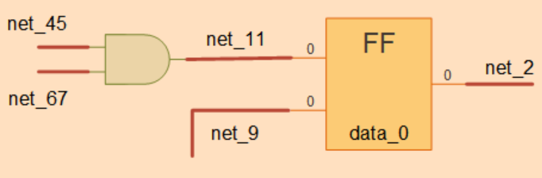
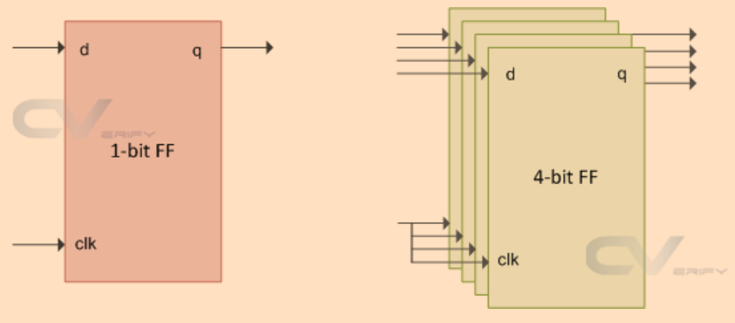
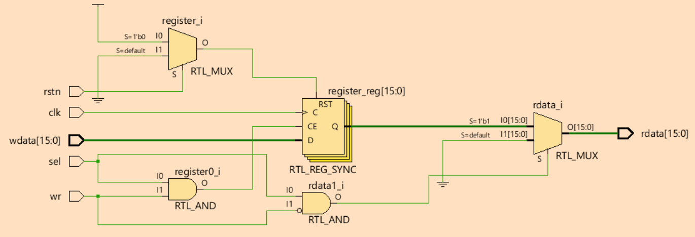
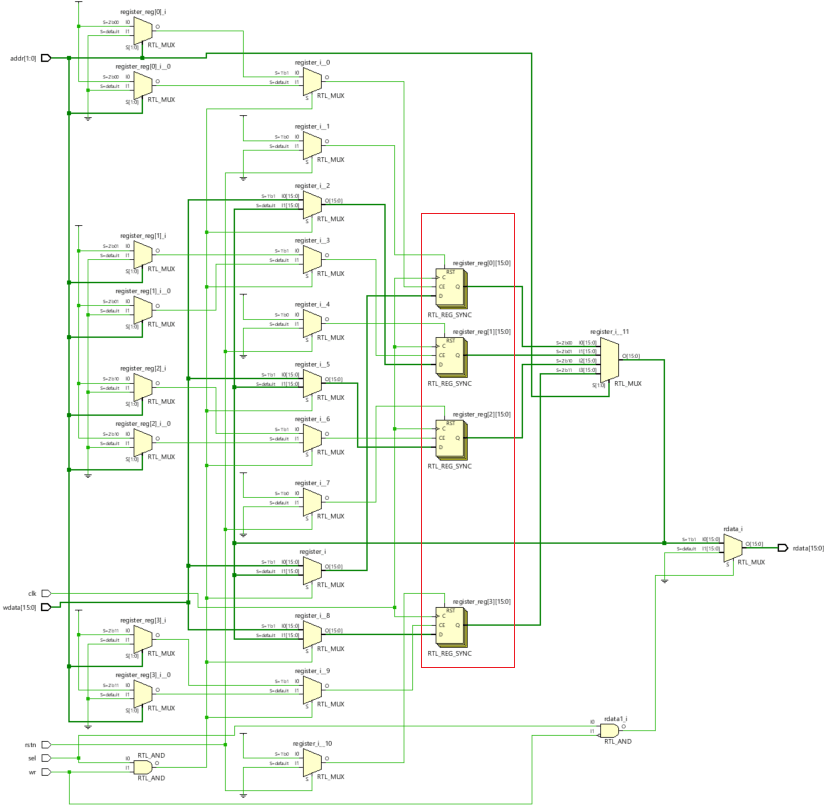
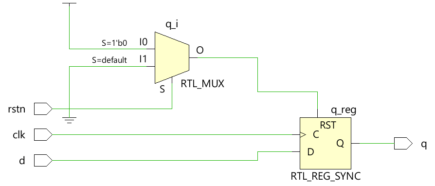
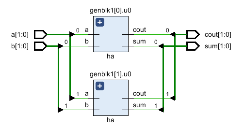

# 概述
本文是[Verilog Tutorial](https://www.chipverify.com/verilog/verilog-tutorial)的学习笔记。

# Verilog数据类型
[例子 types](./code/type/types.v)
## Nets类型
* Nets类型不存储数据，只负责连接
* 常见的Nets类型是`wire`
* 如下图所示，`net_11`连接了AND门电路的输出和触发器的某个输入引脚


## Variables类型
* Variables类型用于存储数据，如触发器可用于存储数据
* 常见的Variables类型是`reg`
* 如下图所示，左侧的触发器可存储1-bit数据，而右侧的触发器可存储4-bits数据


## 其他基本数据类型
* integer
    - 32-bits
    - 整形
* time
    - 64-bits
    - unsigned
    - 用于存储仿真时间，以便调试
    - 整型，表示时间单位的个数
* realtime
    - 浮点型
* real
    - 存储浮点型小数

## 组合数据类型
* 字符串类型
    - Verilog的字符串有`reg`类型构成
    - `reg [8*11:1] str = "Hello World"; // Variable can store 11 bytes, str = "Hello World"`

* Vector
    - 多个net类型或reg类型的组合
    - `wire [3:0] n0;`
    - `reg [3:0] d0;`
    - [例子](./code/vector/register.v)
    

* Array
    - Array和Vector不同，Vector综合后是一个电路单元，Array综合后是多个电路单元
    - Array可以是多个`reg`,`wire`,`integer`,`real`数据类型
    - `reg        y1 [11:0];        // y is an scalar reg array of depth=12, each 1-bit wide`
    - `wire [0:7] y2 [3:0]          // y is an 8-bit vector net with a depth of 4`
    - `reg  [7:0] y3 [0:1][0:3];    // y is a 2D array rows=2,cols=4 each 8-bit wide`
    - [例子](./code/array/registers.v)
    

# Building Blocks

## Verilog模块
* [例子：D触发器模块](./code/dff/dff.v)


* 什么是`top-level module`?
    * top-level模块包含其他所有模块
    * 分为：`Design Top Level Module`和`Testbench Top Level`

## Verilog端口
* 端口类型
    - input
    - output
    - inout
* 所有端口默认声明类型为`wire`
* 输出端口如果需要存储数据，可以声明为`reg`
* 输入端口只能声明为`wire`，因为他们需要被外部立即驱动，而不是接一个触发器再驱动
```verilog
// Case #1 : Inputs are by default implicitly declared as type "wire"
module des0_1  (input wire clk ...);     // wire need not be specified here
module des0_2   (input clk, ...);       // By default clk is of type wire

// Case #2 : Inputs cannot be of type reg
module des1 (input reg clk, ...);     // Illegal: inputs cannot be of type reg

// Case #3: Take two modules here with varying port widths
module des2 (output [3:0] data, ...);  // A module declaration with 4-bit vector as output
module des3 (input [7:0] data, ...);   // A module declaration with 8-bit vector as input

module top ( ... );
wire [7:0] net;
des2  u0 ( .data(net) ... );     // Upper 4-bits of net are undriven
des3  u1 ( .data(net) ... );     
endmodule

// Case #4 : Outputs cannot be connected to reg in parent module
module top_0 ( ... );
reg [3:0] data_reg;

des2 ( .data(data) ...);   // Illegal: data output port is connected to a reg type signal "data_reg"
endmodule
```

## Verilog assign赋值语句
* 赋值声明语句<br>
`assign <net_expression> = [drive_strength] [delay] <expression of different signals or constant value>`
* 赋值规则
    - 左侧接收变量不能是`reg`类型，因为`reg`类型不需要持续赋值，对`reg`类型的赋值需要在`initial`或`always`过程块中进行
    - 只要右侧值发生改变，左侧变量就会被更新一次，因此`assign`也被称为持续赋值

## always过程块
* 语法
```verilog
always @ (event)
  [statement]
 
always @ (event) begin
  [multiple statements]
end
```

* 如果`always`没有定义`sensitivity list`会如何？
    - 如果没有指定`always`的触发条件，仿真程序会持续执行`always`模块
    - `always clk = ~clk;`，这条语句会让仿真程序hang死
    - `always #10 clk = ~clk;`，这条语句会产生周期为20的方波
    - `always`块即可以设计时序电路，也可以设计逻辑电路。两者的区别就是`sensitivity list`不同，如果是逻辑电路，`sensitivity list`监控所有关心变量的变化
    - 因为过程块中被赋值的变量需要是`reg`类型，所以用`always`设计逻辑电路时，输出端口类型不能是`wire`类型

## initial过程块
* 语法
```verilog
initial 
    [single statement]
 
initial begin
[multiple statements]
end
```

* initial过程块的作用是什么？
    - initial过程块不会被综合，因此也不会被转换成硬件电路
    - initial过程块主要用来初始化变量

## 过程块与类型
* Verilog中的三个基本过程块
    - `always @(condition)`
    - `initial`
    - `assign [LHS] = [RHS]`

* 常见规则
    - `reg`只能在`initial`或`always`中被赋值
    - `wire`只能通过`assign`赋值
    - 如果`initial/always`包含多条语句，需要用`begin...end`包裹

## generate过程块(生成块)
* 什么是生成块？
    - 生成块可以动态生成Verilog代码
    - 生成块可以通过参数，对实例引用进行控制
* 循环生成
    - [例子: half-adder](./code/gen-for/half_adder.v)
    - 利用生成块实现了参数化`N`代码，下图是`N=2`的testbench:
    
* 条件生成和case生成
    - 和循环生成一样，控制Verilog代码实现条件
    - [例子：mux](./code/gen-if/mux.v)

## 模式探测器例子
* [Verilog Pattern Detector](./code/detector/det.v)
* 输出结果：
```
T=10 in=0 out=0
T=30 in=0 out=0
T=50 in=0 out=0
T=70 in=0 out=0
T=90 in=0 out=0
T=110 in=1 out=0
T=130 in=1 out=0
T=150 in=0 out=0
T=170 in=1 out=0
T=190 in=0 out=0
T=210 in=1 out=0
T=230 in=1 out=1
T=250 in=1 out=0
T=270 in=0 out=0
T=290 in=1 out=0
T=310 in=0 out=0
T=330 in=1 out=0
T=350 in=1 out=1
T=370 in=1 out=0
T=390 in=1 out=0
T=410 in=1 out=0
Simulation complete via $finish(1) at time 430 NS + 0
```

# Behavioral modeling
## 块
* 两种块
    - 顺序块`begin...end`
    - 并行块`fork...join`
* [例子: 块](./code/block/blocktb.v)